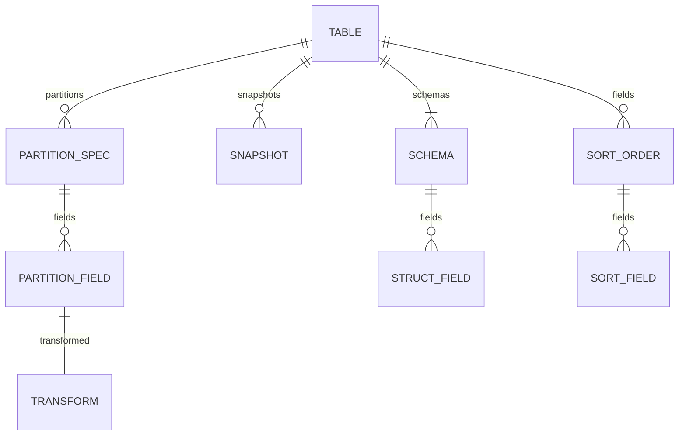

# Iceberg-rs

 **A Rust implementation of Iceberg.**

---

The [Iceberg](https://iceberg.apache.org/) table format is an open table format for analytic datasets. This project is a Rust implementation of the [Iceberg spec](https://iceberg.apache.org/spec/)


## Iceberg-rs in action

```rust
use iceberg_rs::model::TableMetadataV2;

fn main() {
   let data = r#"
       {
           "format-version" : 2,
           "table-uuid": "fb072c92-a02b-11e9-ae9c-1bb7bc9eca94",
           "location": "s3://b/wh/data.db/table",
           "last-sequence-number" : 1,
           "last-updated-ms": 1515100955770,
           "last-column-id": 1,
           "schemas": [
               {
                   "schema-id" : 1,
                   "type" : "struct",
                   "fields" :[
                       {
                           "id": 1,
                           "name": "struct_name",
                           "required": true,
                           "field_type": "fixed[1]"
                       }
                   ]
               }
           ],
           "current-schema-id" : 1,
           "partition-specs": [
               {
                   "spec-id": 1,
                   "fields": [
                       {  
                           "source-id": 4,  
                           "field-id": 1000,  
                           "name": "ts_day",  
                           "transform": "day"
                       } 
                   ]
               }
           ],
           "default-spec-id": 1,
           "last-partition-id": 1,
           "properties": {
               "commit.retry.num-retries": "1"
           },
           "metadata-log": [
               {  
                   "metadata-file": "s3://bucket/.../v1.json",  
                   "timestamp-ms": 1515100
               }
           ],
           "sort-orders": [],
           "default-sort-order-id": 0
       }
   "#;
    let metadata = serde_json::from_str::<TableMetadataV2>(&data).unwrap();
 
}
```

## Features

Currently supported:
* Parsing table metadata v2.

Coming soon:
* Manifest files. 
* Manifest lists.
* v1 table metadata support.
* Validation.

## Iceberg Model

Diagram showing the main `nouns` of the Iceberg model.


## Contributing

If you’d like to contribute, please fork the repository and use a feature branch. We warmly welcomed pull requests.

Please validate all submission with `make validate`.

#### License

<sup>
Licensed under either of <a href="LICENSE-APACHE">Apache License, Version
2.0</a> or <a href="LICENSE-MIT">MIT license</a> at your option.
</sup>

<br>

<sub>
Unless you explicitly state otherwise, any contribution intentionally submitted to include in Iceberg-rs by you, as defined in the Apache-2.0 license, shall be dual licensed as above, with no additional terms or conditions.
</sub>